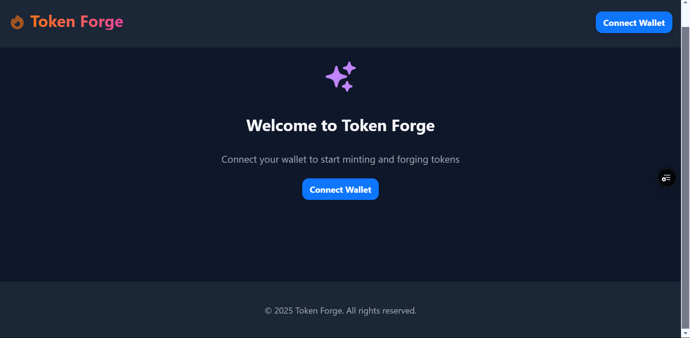
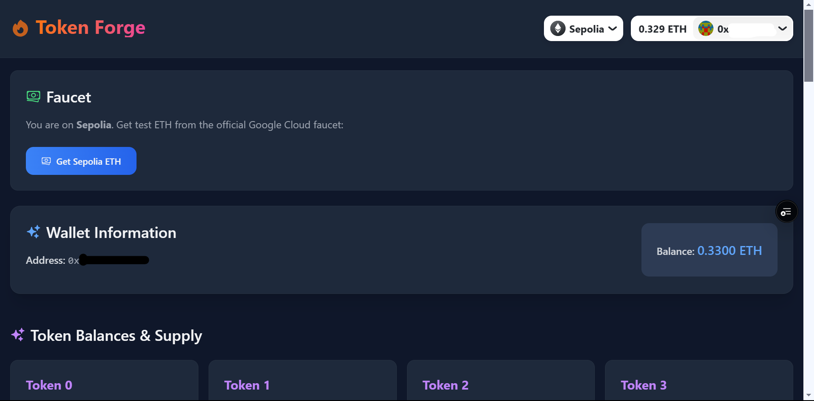
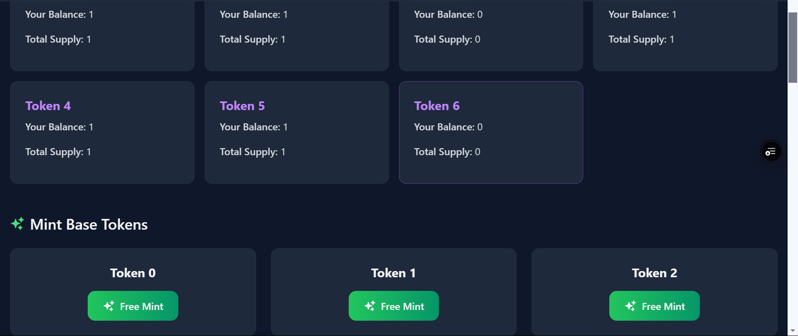
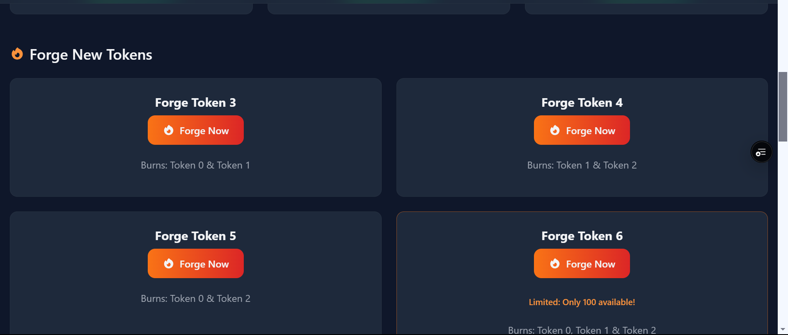
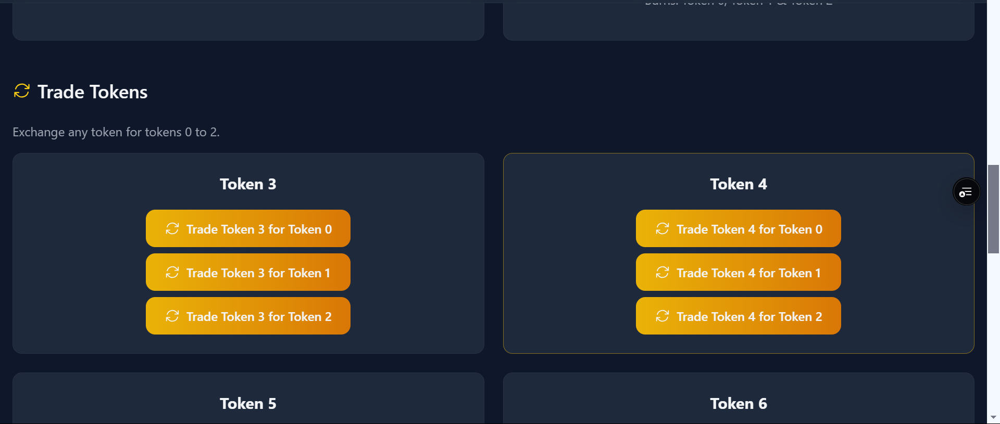
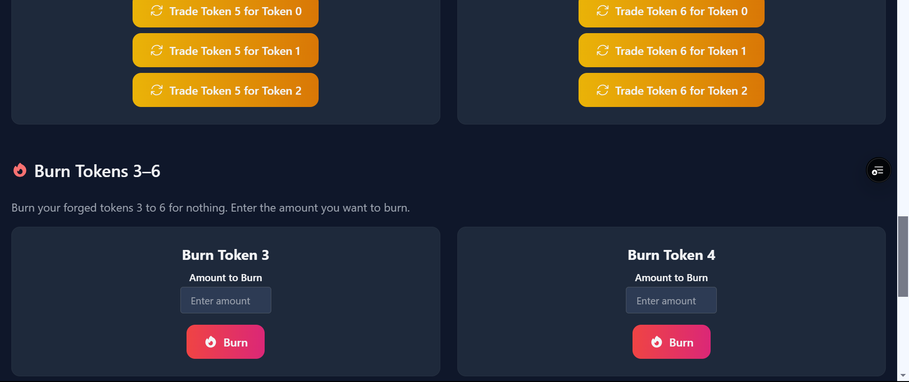
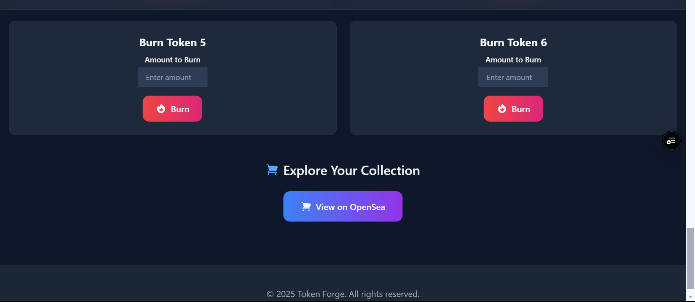

# Token Forge



Token Forge is a decentralized application (dApp) that demonstrates advanced ERC1155 token minting and forging mechanics. It allows users to mint base tokens, forge new tokens by burning combinations of base tokens, trade tokens, and directly burn forged tokens. Built with Solidity, Hardhat, RainbowKit, WAGMI, and Next.js, this dApp is deployed on the Sepolia testnet (with Mainnet support available).



## Overview

- **7 Token Collection:** Tokens with IDs 0–6.
- **Minting:**  
  - **Tokens 0-2 (Base Tokens):** Free to mint (gas fees only) with a 1-minute cooldown per address.
- **Forging:**  
  - **Token 3:** Minted by burning 1 unit each of Token 0 and Token 1.  
  - **Token 4:** Minted by burning 1 unit each of Token 1 and Token 2.  
  - **Token 5:** Minted by burning 1 unit each of Token 0 and Token 2.  
  - **Token 6 (Rare Token):** Minted by burning 1 unit each of Tokens 0, 1, and 2. **(Limited to 100 tokens)**
- **Trading:**  
  - Any token can be traded for a base token (Tokens 0–2).
- **Burning:**  
  - Forged tokens (Tokens 3–6) can be directly burned for nothing.
- **Network:**  
  - The dApp runs on the Sepolia testnet (and optionally Mainnet) for cost-effective transactions.
- **Metadata:**  
  - Token metadata is hosted on IPFS via Pinata. Make sure your IPFS folder contains correctly named metadata JSON files (e.g. `0.json`, `1.json`, etc.) matching the URI logic.
- **Wallet Requirement:**  
  - The app forces usage of MetaMask. If another wallet (e.g., Phantom) is active, users are prompted to disable it.
- **Network Switch:**  
  - The dApp auto-prompts a switch to the Sepolia network if you’re not already connected.

## Deployed Contract Addresses (Sepolia)

- **ForgeableERC1155:** `0xB8bdf234e02a03f50e9B3E8295308765af87f6c6`  
- **TokenForge:** `0x2C3c9c4870609A88106481Ca5898208b726530C8`

*Note: These addresses are for the Sepolia testnet. Replace them with Mainnet addresses if you deploy there.*

## Live Demo & Preview

- **Vercel Preview:** [https://my-dapp-demosampleacc-gmailcom-devds-projects-0114b344.vercel.app/](https://my-dapp-demosampleacc-gmailcom-devds-projects-0114b344.vercel.app/)
- **OpenSea Testnet Account:** [https://testnets.opensea.io/account](https://testnets.opensea.io/account)

## How It Works

1. **Wallet Connection:**  
   - Connect your MetaMask wallet. The dApp will prompt you to switch to the Sepolia network if needed.
2. **Minting Base Tokens:**  
   - Use the "Free Mint" buttons for Tokens 0–2. Each mint is free (except for gas fees) but limited to one per minute per address.
3. **Forging New Tokens:**  
   - Forge new tokens by burning the required base tokens:
     - **Token 3:** Burns 1 unit of Token 0 and 1 unit of Token 1.
     - **Token 4:** Burns 1 unit of Token 1 and 1 unit of Token 2.
     - **Token 5:** Burns 1 unit of Token 0 and 1 unit of Token 2.
     - **Token 6:** Burns 1 unit each of Tokens 0, 1, and 2 (*Limited to 100 tokens*).
4. **Trading:**  
   - Trade any forged token (Tokens 3–6) for a base token (Tokens 0–2) by clicking the appropriate trade button.
5. **Burning:**  
   - Directly burn forged tokens (Tokens 3–6) for nothing by specifying the amount to burn.

## Setup & Deployment Instructions

### 1. Clone the Repository

```bash
git clone https://github.com/yourusername/your-repo-name.git
cd your-repo-name
```

### 2. Install Dependencies

For the Hardhat project:

```bash
cd packages/hardhat
yarn install
```

For the Next.js front-end:

```bash
cd ../nextjs
yarn install
```

### 3. Deploy Smart Contracts

From the `packages/hardhat` folder, deploy your contracts to the Sepolia network:

```bash
yarn deploy --network sepolia --tags ForgeContracts
```

Record the deployed contract addresses (they should match the ones provided above).

### 4. Configure Environment Variables

Create or update your `.env` file in `packages/nextjs` with the following:

```
NEXT_PUBLIC_ALCHEMY_API_KEY=yourAlchemyApiKey
NEXT_PUBLIC_ERC1155_ADDRESS_SEPOLIA=0xB8bdf234e02a03f50e9B3E8295308765af87f6c6
NEXT_PUBLIC_FORGE_ADDRESS_SEPOLIA=0x2C3c9c4870609A88106481Ca5898208b726530C8
```

Ensure your `networkAddresses.ts` reflects these addresses correctly.

### 5. Run the Front-End

From the `packages/nextjs` folder, run:

```bash
yarn start
```

Your dApp should now be accessible at [http://localhost:3000](http://localhost:3000).

## Additional Considerations

- **Sufficient ETH:**  
  - Ensure your MetaMask wallet has enough Sepolia ETH for gas fees.
- **Limited Token:**  
  - Token 6 is limited to 100 mints. Attempts to mint beyond that will fail.
- **MetaMask Requirement:**  
  - The dApp enforces the use of MetaMask. If Phantom or another wallet is active, users will be prompted to disable it.
- **Network Switching:**  
  - The dApp will automatically prompt you to switch to the Sepolia network if your wallet is on a different chain.
- **Metadata Availability:**  
  - If metadata doesn’t load immediately on OpenSea, click “Refresh Metadata” on your collection page or wait a few minutes for indexing.

