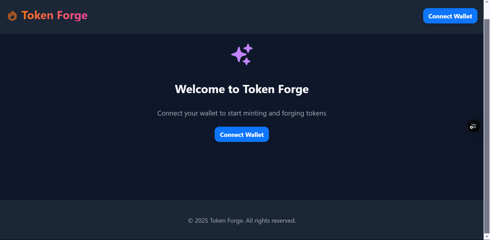
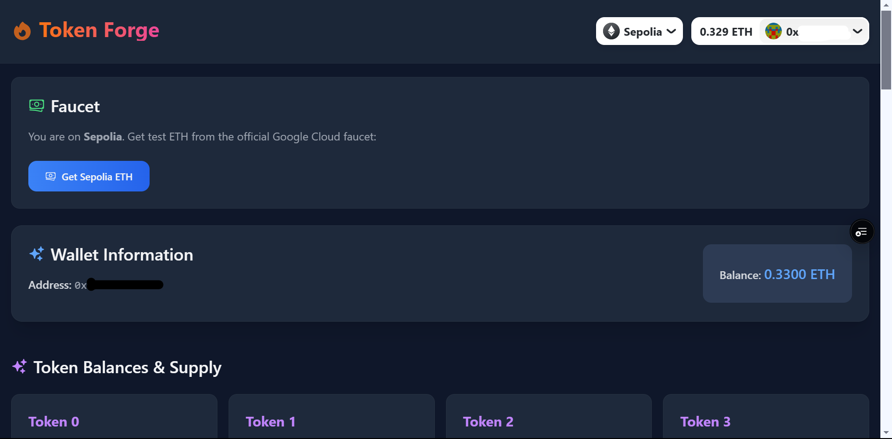
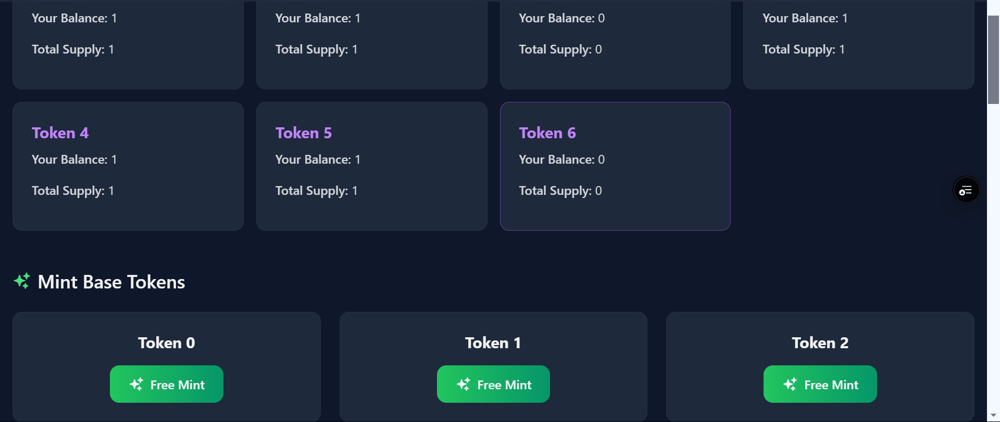
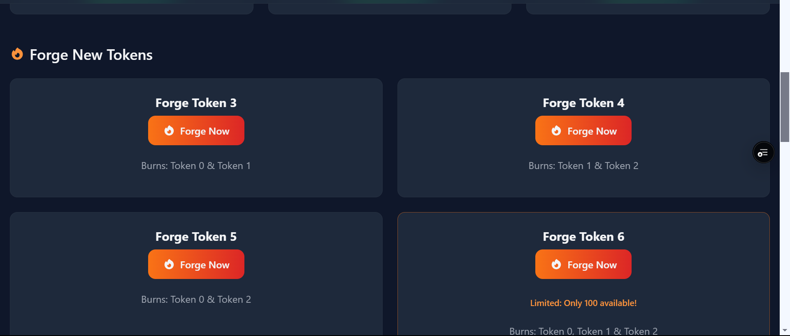
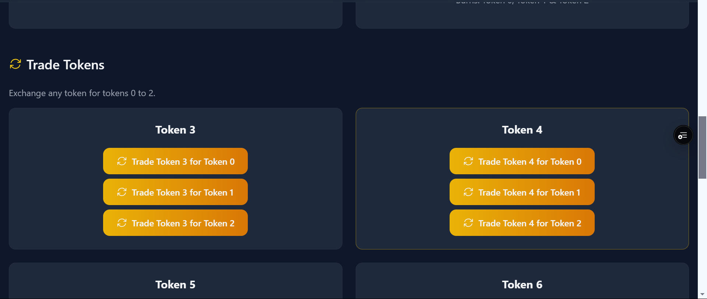
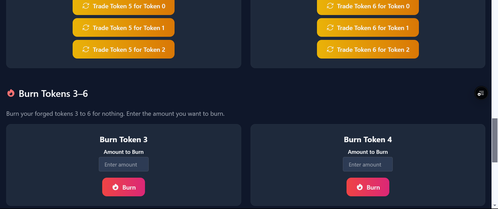
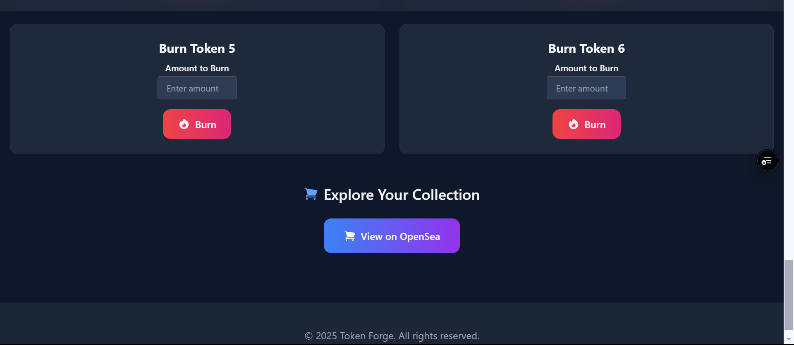

# Token Forge



Token Forge is a decentralized application (dApp) that demonstrates advanced ERC1155 token minting and forging mechanics. It allows users to mint base tokens, forge new tokens by burning combinations of base tokens, trade tokens, and directly burn forged tokens. Built with Solidity, Hardhat, RainbowKit, WAGMI, and Next.js, this dApp is deployed on the Sepolia testnet (with Mainnet support available).

<p align="center" style="margin:0;">
  
  
  
  
  
  
</p>

## Skills Demonstrated

- **Blockchain Development:**
Proficient use of Solidity for ERC1155 token creation and forging mechanics. Hands-on experience with smart contract deployment using Hardhat and integration with the Sepolia testnet. The smart contracts support minting (Tokens 0–2), forging (Tokens 3–6), trading, and burning of tokens.

- **Web3 Integration:**
Utilized WAGMI and RainbowKit for seamless Web3 connectivity with MetaMask, enabling the connection, transaction, and wallet interaction with the dApp.

- **Smart Contract Security:**
Ensured contract security using OpenZeppelin libraries such as Ownable, ERC1155, and ReentrancyGuard. Developed safe functions to mint, forge, trade, and burn tokens while preventing reentrancy attacks.

- **Frontend Development:**
Built a user-friendly frontend using Next.js with a focus on responsive design and smooth UX/UI. Integrated real-time blockchain data using ethers.js to manage minting, forging, trading, and burning actions directly from the user interface. Additionally, implemented toast notifications for providing users with real-time feedback on their actions, such as successful transactions or errors.

- **IPFS for NFTs:**
Proficient use of IPFS for decentralized storage of NFTs. All token metadata, including images, is stored and pinned on Pinata/IPFS nodes. The use of IPFS ensures that token information (such as names, descriptions, and images) remains decentralized and immutable, facilitating the minting (for Tokens 0–2), forging (Tokens 3–6), burning, and trading mechanisms within the dApp.

- **Testing and Unit Testing:**
We performed unit testing for the ForgeableERC1155 smart contract, which handles the core forging logic. The test scripts are located in packages/hardhat/test/ForgingDapp.test.ts.
The test report can be found in TESTING_REPORT.md, providing detailed information on the testing outcomes.

## Overview

- **7 Token Collection:** Tokens with IDs 0–6.
- **Minting:**  
  - **Tokens 0-2 (Base Tokens):** Free to mint (gas fees only) with a 1-minute cooldown per address.
- **Forging:**  
  - **Token 3:** Minted by burning 1 unit each of Token 0 and Token 1.  
  - **Token 4:** Minted by burning 1 unit each of Token 1 and Token 2.  
  - **Token 5:** Minted by burning 1 unit each of Token 0 and Token 2.  
  - **Token 6 (Rare Token):** Minted by burning 1 unit each of Tokens 0, 1, and 2. **(Limited to 100 tokens)**
- **Trading:**  
  - Any token can be traded for a base token (Tokens 0–2).
- **Burning:**  
  - Forged tokens (Tokens 3–6) can be directly burned for nothing.
- **Network:**  
  - The dApp runs on the Sepolia testnet (and optionally Mainnet) for cost-effective transactions.
- **Metadata:**  
  - Token metadata is hosted on IPFS via Pinata. Ensure your IPFS folder contains correctly named metadata JSON files (e.g. `0.json`, `1.json`, etc.) matching the URI logic.
- **Wallet Requirement:**  
  - The app forces usage of MetaMask. If another wallet (e.g., Phantom) is active, users are prompted to disable it.
- **Network Switch:**  
  - The dApp auto-prompts a switch to the Sepolia network if you’re not already connected.

## Deployed Contract Addresses (Sepolia)

- **ForgeableERC1155:** [0xB8bdf234e02a03f50e9B3E8295308765af87f6c6](https://sepolia.etherscan.io/address/0xB8bdf234e02a03f50e9B3E8295308765af87f6c6#writeContract) 
- **TokenForge:** [0x2C3c9c4870609A88106481Ca5898208b726530C8](https://sepolia.etherscan.io/address/0x2C3c9c4870609A88106481Ca5898208b726530C8#writeContract)

*Note: These addresses are for the Sepolia testnet. Replace them with Mainnet addresses if you deploy there.*

## Live Demo & Preview

- **Vercel Deployment:** [https://my-dapp-liart.vercel.app/](https://my-dapp-csivazcdo-devds-projects-0114b344.vercel.app/)
- **OpenSea Testnet Account:** [https://testnets.opensea.io/account](https://testnets.opensea.io/account)

## How It Works

1. **Wallet Connection:**  
   - Connect your MetaMask wallet. The dApp will prompt you to switch to the Sepolia network if needed.
2. **Minting Base Tokens:**  
   - Use the "Free Mint" buttons for Tokens 0–2. Each mint is free (except for gas fees) but limited to one per minute per address.
3. **Forging New Tokens:**  
   - Forge new tokens by burning the required base tokens:
     - **Token 3:** Burns 1 unit of Token 0 and 1 unit of Token 1.
     - **Token 4:** Burns 1 unit of Token 1 and 1 unit of Token 2.
     - **Token 5:** Burns 1 unit of Token 0 and 1 unit of Token 2.
     - **Token 6:** Burns 1 unit each of Tokens 0, 1, and 2 (*Limited to 100 tokens*).
4. **Trading:**  
   - Trade any forged token (Tokens 3–6) for a base token (Tokens 0–2) by clicking the appropriate trade button.
5. **Burning:**  
   - Directly burn forged tokens (Tokens 3–6) for nothing by specifying the amount to burn.

## Setup & Deployment Instructions

### 1. Clone the Repository

```bash
git clone https://github.com/yourusername/your-repo-name.git
cd your-repo-name
```

### 2. Install Dependencies

For the Hardhat project:

```bash
cd packages/hardhat
yarn install
```

For the Next.js front-end:

```bash
cd ../nextjs
yarn install
```

### 3. Deploy Smart Contracts

From the `packages/hardhat` folder, deploy your contracts to the Sepolia network:

```bash
yarn deploy --network sepolia --tags ForgeContracts
```

Record the deployed contract addresses (they should match the ones provided above).

### 4. Configure Environment Variables

Create or update your `.env` file in `packages/nextjs` with the following:

```
NEXT_PUBLIC_ALCHEMY_API_KEY=yourAlchemyApiKey
NEXT_PUBLIC_ERC1155_ADDRESS_SEPOLIA=0xB8bdf234e02a03f50e9B3E8295308765af87f6c6
NEXT_PUBLIC_FORGE_ADDRESS_SEPOLIA=0x2C3c9c4870609A88106481Ca5898208b726530C8
```

Ensure your `networkAddresses.ts` reflects these addresses correctly.

### 5. Run the Front-End

From the `packages/nextjs` folder, run:

```bash
yarn start
```

Your dApp should now be accessible at [http://localhost:3000](http://localhost:3000).

## Unit Testing
Unit tests have been written for the core logic of the smart contract, particularly the forging mechanisms, in the *packages/hardhat/test/ForgingDapp.test.ts* file. The testing suite ensures the robustness and reliability of the contract’s functionality, covering all key actions such as minting, forging, and burning of tokens. For a detailed overview of the tests and their results, refer to the TESTING_REPORT.md file.

## Additional Considerations

- **Sufficient ETH:**  
  - Ensure your MetaMask wallet has enough Sepolia ETH for gas fees.
- **Limited Token:**  
  - Token 6 is limited to 100 mints. Attempts to mint beyond that will fail.
- **MetaMask Requirement:**  
  - The dApp enforces the use of MetaMask. If another wallet (like Phantom) is active, users will be prompted to disable it.
- **Network Switching:**  
  - The dApp automatically prompts you to switch to the Sepolia network if your wallet is on a different chain.
- **Metadata Availability:**  
  - If metadata doesn’t load immediately on OpenSea, click “Refresh Metadata” on your collection page or wait a few minutes for indexing.

